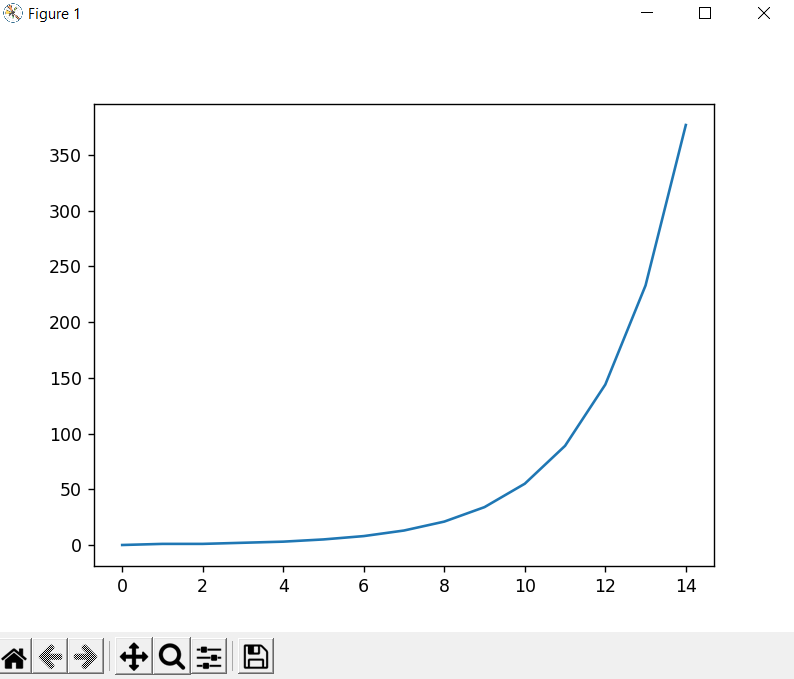

# The Fibonacci graph

This program build a graph for Fibonacci numbers.

Thanks [Time module](https://pypi.org/project/time/), [Matplotlib](https://matplotlib.org/).

## Example of work
---

# Documentation
The program show "Enter the number to which will be calculate Fibonacci number graph:". Write the max number to the Fibonacci numbers will calculate.